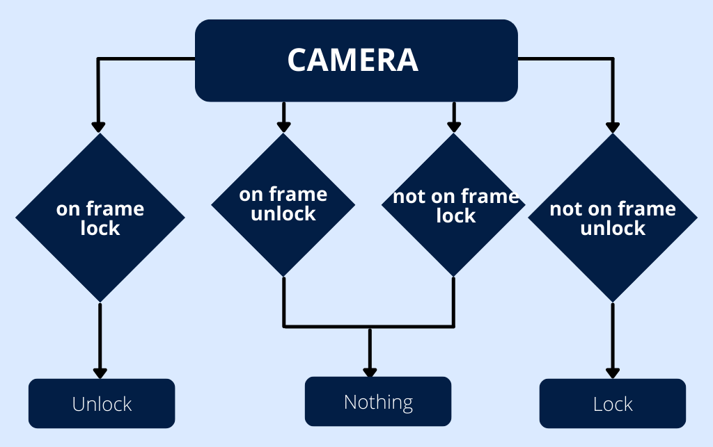

<!-- LOGO -->
<br />
<h1>
<p align="center">
  


</h1>
  <p align="center">
    Python package to (un)lock your computer smarter.
    <br />
  </p>
</p>

<p align="center">
  <a href="#rocket-about-the-project">About The Project</a> •
  <a href="#wrench-installation">Installation</a> •
  <a href="#unlock-usage">How To Use it</a> •
  <a href="#question-how-does-it-work">How Does It Work</a> 
</p>  

## :rocket: About The Project

This small Python package will allow you to lock and unlock your computer
in a smart way, using facial recognition.
It allows you to both automatically lock the screen when you leave your workstation,
as well as unlock the computer when you return.
Without ever typing anything on the keyboard.

> this is a citation


## :wrench: Installation

The first step is to clone the repository, by doing :

```bash
cd my/application/path
git clone git@github.com:Arnautt/smartlocker.git
cd smartlocker
```

Then, install a virtual environment and all the necessary packages :


```bash
make build-env
```

You're now ready to use the application.

## :unlock: Usage

1. Configure an environment file (`.env` file) with the following features : 

```env
PASSWORD=
SLEEPING_TIME= 
FACES_LOCATION=
```

where password is your personal password to unlock the computer,
sleeping time is the number of seconds between two camera scans to know which action to perform (lock, unlock or nothing),
and faces location is the path where the pictures of you are stored (you can for example make a hidden folder).

2. In order to do face recognition, you must pass to the algorithm some pictures of you, with as many angles as possible. 
Let us guide you by running the following command : 

```bash
make generate-data
```


3. Run the main script and enjoy !


```bash
make main
```

## :question: How does it work 

The basic idea is to use [face recognition](https://github.com/ageitgey/face_recognition), a state-of-the-art face recognition
algorithm built with deep learning, to detect if I am in front of the camera or not.
There are then only 4 cases as illustrated below.


<p align="center">
  
</p>


To reduce the complexity of the program, once we have performed a step above,
the program does nothing for a number of seconds determined by the configuration file.

The actions at the bottom of the graph are simply executed through the os package and bash commands.


:arrow_right: *Technical stack:* Python, OpenCV, face_recognition
